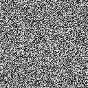

# 8Crafter's Random Image Generator


[](https://npmjs.com/package/random-image-generator-plus)
[](https://npmjs.com/package/random-image-generator-plus)
[](https://npmjs.com/package/random-image-generator-plus)
[](https://npmjs.com/package/random-image-generator-plus)
[](https://npmjs.com/package/random-image-generator-plus)
[](https://github.com/8Crafter-Studios/random-image-generator/commits/main)
[](https://discord.gg/jrCTeHGuhx)

This Node.js program generates images by setting each pixel to a randomly colored pixel.

It has both a CLI and module exports.

The program supports the following image formats: PNG, JPEG, PDF, and SVG.

For JPEG images, the program has options to enable chroma subsampling and progressive encoding, and to set the quality.

## CLI

```
Usage:

random-image-generator-plus generate [options] [width] [height] [scale] [directory]      Generate a random image of the specified dimensions.
random-image-generator-plus version                                                      Shows the version number.
random-image-generator-plus help                                                         Show this help message.
random-image-generator-plus -h                                                           Show this help message.
random-image-generator-plus --help                                                       Show this help message.

Options:
  -o, --overwrite             Overwrite the image file if it already exists.
  -g, --grayscale             Generate a grayscale image.
  -n, --name=<name>           Set the name of the image file (extension not included, requires quotes if the name contains spaces).
  -d-pa, --debug-print-args   Print the arguments and resolved configuration to the console. Useful for debugging.
  -dr, --dry-run              Prevents the command from actually modifying anything, enabling this flag also enabled the --debug-print-args flag.
  -jpg, -jpeg                 Generate a JPEG image instead of a PNG image.
  -pdf                        Generate a PDF image instead of a PNG image.
  -svg                        Generate an SVG image instead of a PNG image.
  --chroma-subsampling        Enable chroma subsampling for JPEG images.
  --progressive               Enable progressive encoding for JPEG images.
  --quality=<quality>         Set the quality of the JPEG image, should be a float between 0 and 1 (inclusive). Default is 0.75.

Paramters:
[width]         The width of the image. If not provided, the width will be 128 pixels.
[height]        The height of the image. If not provided, the height will be 128 pixels.
[scale]         The scale of the image, this specifies the size of each pixel, this will not affect the width or height of the image. If not provided, the scale will be 1. Format should be "scaleX:scaleY" or "scale".
[directory]     The directory to save the image in (requires quotes if the directory contains spaces). If not provided, the image will be saved in ./corruptedImages.
```

## Module

```js
import { generateRandomImage } from "random-image-generator-plus";

// Generate a colored 128x128 PNG image and save it to ./corruptedImage.png.
fs.writeFileSync("./corruptedImage.png", generateRandomImage({ width: 128, height: 128, scale: [1, 1], grayscale: false }));

// Generate a colored 128x128 JPEG image with chroma subsampling, progressive encoding, and maximum quality and save it to ./corruptedImage.jpg.
fs.writeFileSync(
    "./corruptedImage.jpg",
    generateRandomImage({
        width: 128,
        height: 128,
        scale: [1, 1],
        grayscale: false,
        format: "jpg",
        jpegOptions: { chromaSubsampling: true, progressive: true, quality: 1 },
    })
);

// Generate a grayscale 128x128 PDF image and save it to ./corruptedGrayscaleImage.pdf.
fs.writeFileSync("./corruptedGrayscaleImage.pdf", generateRandomImage({ width: 128, height: 128, scale: [1, 1], grayscale: true, format: "pdf" }));

// Generate a grayscale 128x128 SVG image with pixels of size 20x64 and save it to ./corruptedGrayscaleImage.svg.
fs.writeFileSync("./corruptedGrayscaleImage.svg", generateRandomImage({ width: 128, height: 128, scale: [20, 64], grayscale: true, format: "svg" }));
```

## Sample Images

### No Arguments


### Height: 512


### Width: 256, Height: 256, Scale: [x: 20, y: 64]

![Scale: [x: 20, y: 64]](./sample_images/scale-20-64.png)

### Width: 256, Height: 256, Scale: [x: 20, y: 64], Grayscale: true

![Scale: [x: 20, y: 64], Grayscale: true](./sample_images/scale-20-64-grayscale-true.png)

### Grayscale: true


